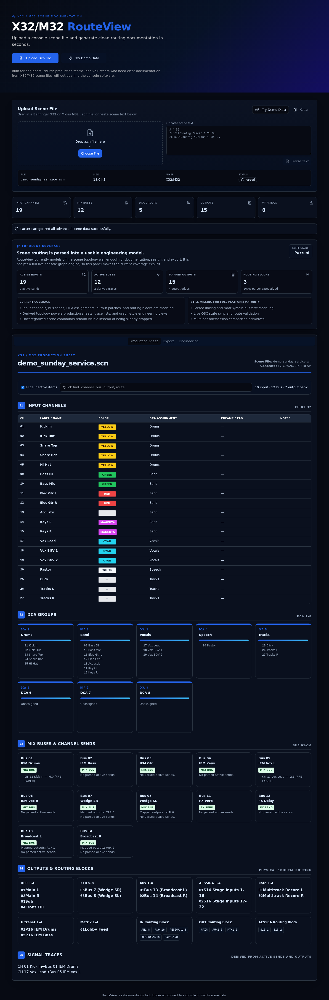

# X32/M32 RouteView

Topology-aware documentation and visualization tool for **Behringer X32** and **Midas M32** scene (`.scn`) files.


## Project summary

RouteView turns mixer scene files into human-readable routing documentation. Instead of handing a volunteer, guest engineer, or replacement operator a raw `.scn` file and hoping they can decode it, the app parses the scene, normalizes the routing model, and presents it in a structured workspace.

## Who it is for

- church AV teams
- technical directors
- venue and club engineers
- broadcast teams
- theater and education environments
- rental providers and freelancers doing engineer handoff
- volunteers onboarding into an existing console showfile

## Problem it solves

X32/M32 scene files are powerful, but they are not a friendly operating document. RouteView helps teams:
- understand channel layout and routing faster
- trace signal flow during troubleshooting
- produce production sheets for handoff
- review console setup without loading the showfile on the console first
- keep documentation closer to the actual scene file

## Current status

**Active early-stage church technology project.**

Confirmed in the default branch today:
- `.scn` upload and parsing for X32/M32 scene files
- normalized scene model for channels, buses, DCAs, outputs, and routing blocks
- conservative parser behavior that keeps unknown/unhandled lines visible
- export helpers for markdown and CSV outputs
- tests around parser, scene model, and topology graph behavior
- browser UI for upload, demo data, and documentation-oriented views

A documentation/export polish branch is also in progress to expand generated docs search, export formats, screenshots, and handoff workflows.

## Features

- `.scn` upload/parsing for X32 / M32 scene files
- scene overview for channels, buses, DCAs, and output patches
- signal-tracing and topology-oriented modeling through the scene graph/domain model
- production-sheet style export workflows
- routing maps and readable summaries for handoff
- conservative parser bucket summaries for unsupported or partially parsed constructs
- volunteer onboarding and engineer handoff friendly presentation
- browser-based review flow with demo data

## Supported mixer files

Currently confirmed:
- Behringer X32 scene files (`.scn`)
- Midas M32 scene files (`.scn`)

The parser is intentionally conservative. Unsupported commands are summarized instead of silently discarded.

## Screenshots / demo

### Home / upload workflow


### Production-sheet style workspace with demo data



## Architecture

```text
src/pages/              Top-level UI routes
src/components/         View and workspace components
src/parsers/            Scene parser implementations
src/lib/                Exporters, scene logic, graph/topology helpers
src/types/              Typed routing/domain models
src/test/               Parser and model tests
public/                 Static assets
```

## Tech stack

- React 18
- TypeScript
- Vite
- Tailwind CSS
- Radix UI primitives
- Vitest
- ESLint

## Quick start

```bash
npm install
npm run dev -- --host 0.0.0.0
```

Open `http://localhost:8080`.

## Usage

See [docs/demo-workflow.md](docs/demo-workflow.md) for a step-by-step local demo and operator handoff walkthrough.

### Sample workflow

1. open RouteView in the browser
2. upload an X32 or M32 `.scn` file, or use the demo data
3. inspect channel, bus, DCA, output, and routing summaries
4. review parser bucket summaries to see what is still partially interpreted
5. export markdown/CSV views for production sheets or handoff notes
6. print or save the exported documentation as PDF from the browser if needed

## Project structure

```text
src/
  components/
  lib/
  pages/
  parsers/
  test/
  types/
docs/
public/
```

## Testing

```bash
npm install
npm run lint
npm run test
npm run build
```

Confirmed tests include:
- `src/test/x32-parser.test.ts`
- `src/test/scene-model.test.ts`
- `src/test/topology-graph.test.ts`

## Deployment

Local preview:

```bash
npm run build
npm run preview
```

The repo also includes `vercel.json` for static deployment-oriented hosting workflows.

## Roadmap

See [ROADMAP.md](ROADMAP.md).

Near-term priorities:
- expand parser coverage for more console detail categories
- improve route graph readability and export reliability
- deepen production-sheet workflows
- improve print/PDF handoff presentation

## Open-source positioning

RouteView is written as a practical operator tool, not as a vague SaaS concept. Future commercial work, such as optional premium templates or consulting around AV documentation workflows, should only sit on top of a strong open-source core.

## Contributing

See [CONTRIBUTING.md](CONTRIBUTING.md).

## Security

See [SECURITY.md](SECURITY.md).

## License

This repository includes a [LICENSE](LICENSE) file.
