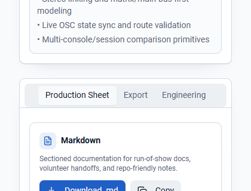

# X32/M32 RouteView

Topology-aware documentation and visualization tool for **Behringer X32** and **Midas M32** scene (`.scn`) files.


## Project summary

RouteView turns mixer scene files into human-readable routing documentation. Instead of handing a volunteer, engineer, or replacement operator a raw `.scn` file and hoping they can decode it, the app parses the scene, normalizes the routing model, and presents it in a structured workspace.

## Who it is for

- church AV teams
- venue and club engineers
- broadcast teams
- theater and education environments
- rental providers and freelancers doing engineer handoff
- volunteers onboarding into an existing console showfile

## Problem it solves

X32/M32 scene files are powerful, but they are not a friendly operating document. RouteView helps teams:
- understand channel layout and routing faster
- trace signal flow during troubleshooting
- produce production sheets for handoff
- review console setup without loading the showfile on the console first
- keep documentation closer to the actual scene file

## Current status

**Production-focused local documentation tool.**

Confirmed in the repository today:
- validated drag-and-drop, browse, paste, replace, and cancel upload paths
- local `.scn` parsing for X32/M32 scene files; scene data is not uploaded
- normalized scene model for channels, buses, DCAs, outputs, and routing blocks
- conservative parser behavior that keeps unknown/unhandled lines visible
- instant client-side search, jump links, collapsible sections, highlights, reset, and no-results states inside the generated production sheet
- exports for Markdown, HTML, JSON, plain text, CSV, and browser print/PDF with clean scene/date filenames
- tests around parser, scene model, and topology graph behavior
- browser UI for upload, demo data, documentation review, and professional handoff

## Features

- `.scn` upload/parsing for X32 / M32 scene files
- drag-and-drop upload with file type and size validation
- clear processing status for file reading, parsing, routing analysis, documentation generation, and finalization
- scene overview for channels, buses, DCAs, and output patches
- searchable production sheet with jump links, collapsible sections, match highlighting, reset search, and helpful empty states
- signal-tracing and topology-oriented modeling through the scene graph/domain model
- professional exports to Markdown, HTML, JSON, plain text, CSV, and browser print/PDF
- clean export filenames based on the scene name and export date
- routing maps and readable summaries for handoff
- conservative parser bucket summaries for unsupported or partially parsed constructs
- volunteer onboarding and engineer handoff friendly presentation
- browser-based review flow with demo data

## Supported mixer files

Currently confirmed:
- Behringer X32 scene files (`.scn`)
- Midas M32 scene files (`.scn`)

The parser is intentionally conservative. Unsupported commands are summarized instead of silently discarded.

## Screenshots / demo

### Home / upload workflow


### Upload success state


### Generated documentation workspace


### Export menu



## Architecture

```text
src/pages/              Top-level UI routes
src/components/         View and workspace components
src/parsers/            Scene parser implementations
src/lib/                Exporters, scene logic, graph/topology helpers
src/types/              Typed routing/domain models
src/test/               Parser and model tests
public/                 Static assets
```

## Tech stack

- React 18
- TypeScript
- Vite
- Tailwind CSS
- Radix UI primitives
- Vitest
- ESLint

## Quick start

```bash
npm install
npm run dev -- --host 0.0.0.0
```

Open `http://localhost:8080`.

## Usage

See [docs/demo-workflow.md](docs/demo-workflow.md) for a step-by-step local demo and operator handoff walkthrough.

### Sample workflow

1. open RouteView in the browser
2. drag in an X32 or M32 `.scn` file, browse for one, paste scene text, or use demo data
3. watch the upload and parsing status until the documentation is generated
4. use jump links, collapsible sections, and Quick find to search channel, bus, output, route, DCA, and signal-trace content
5. inspect channel, bus, DCA, output, routing, warnings, handoff notes, and parser bucket summaries
6. export Markdown, HTML, JSON, plain text, CSV, or print/save as PDF; downloaded files use the scene name plus the export date

## Project structure

```text
src/
  components/
  lib/
  pages/
  parsers/
  test/
  types/
docs/
public/
```

## Testing

```bash
npm install
npm run lint
npm run test
npm run build
```

Confirmed tests include:
- `src/test/x32-parser.test.ts`
- `src/test/scene-model.test.ts`
- `src/test/topology-graph.test.ts`
- `src/test/upload-validation.test.ts`
- `src/test/exporters.test.ts`

## Deployment

Local preview:

```bash
npm run build
npm run preview
```

The repo also includes `vercel.json` for static deployment-oriented hosting workflows.

Production target: <https://routeview.mell0wx.tech>

Before a release, follow the [production runbook](docs/PRODUCTION_RUNBOOK.md), review
the [launch-readiness report](docs/LAUNCH_READINESS.md), and publish the matching
[release notes](docs/RELEASE_NOTES_1.0.0.md).

## Roadmap

See [ROADMAP.md](ROADMAP.md).

Near-term priorities:
- expand parser coverage for more console detail categories
- improve route graph readability and export reliability
- deepen production-sheet workflows
- improve print/PDF handoff presentation

## Open-source positioning

RouteView is written as a practical operator tool, not as a vague SaaS concept. Future commercial work, such as optional premium templates or consulting around AV documentation workflows, should only sit on top of a strong open-source core.

## Contributing

See [CONTRIBUTING.md](CONTRIBUTING.md).

## Security

See [SECURITY.md](SECURITY.md).

## License

This repository includes a [LICENSE](LICENSE) file.
